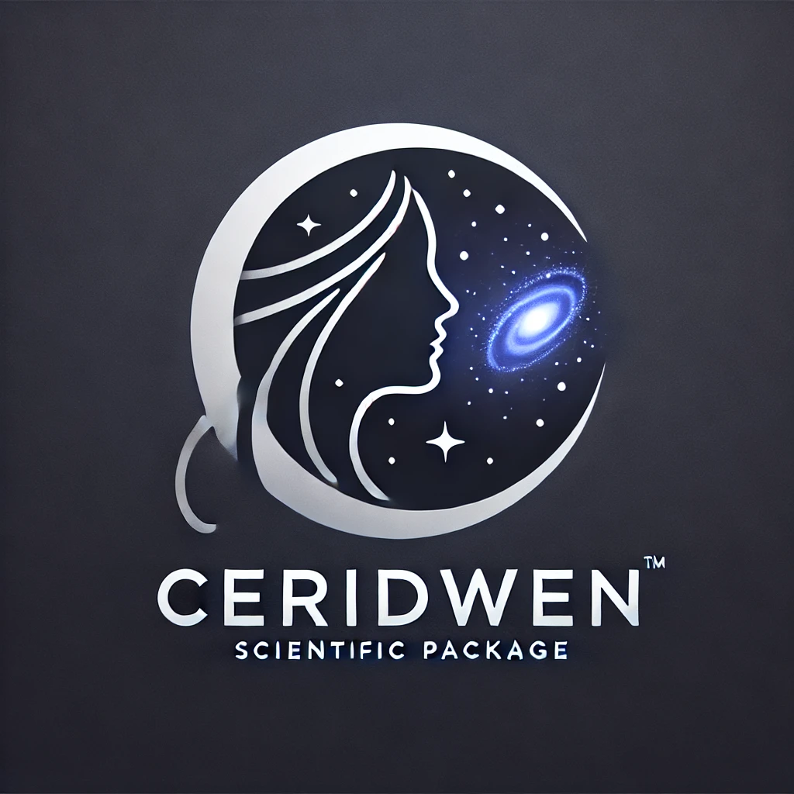

# Ceridwen

Comprehensive SED Estimation Routine Involving Data-driven WEight calculatioNs

## Version 1.0 in progress

- [x] Star Formation History
- [x] Metallicity History
- [x] Dust Attenuation
- [x] Dust Emission
- [ ] Nebular Continuum and Line Emission
- [ ] alpha Enhanced SSPs
- [ ] Observation Input
- [ ] Model Build